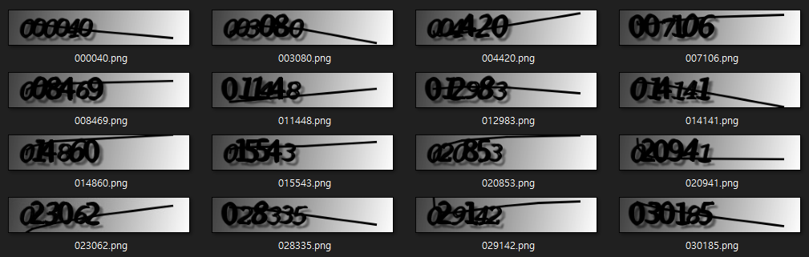

# CaptchaCracker


[](https://www.linkedin.com/in/wooil/) 

[English document](./README.md)

## 소개

CaptchaCracker는 Captcha Image 인식을 위한 딥 러닝 모델 생성 기능과 적용 기능을 제공하는 오픈소스 파이썬 라이브러리입니다. 아래와 같은 Captcha Image의 숫자를 인식해 숫자 문자열을 출력하는 딥 러닝 모델을 만들거나 모델을 직접 사용해볼 수 있습니다.


### 입력 이미지


### 출력 문자열

```
023062
```


## 예제

- 실행 전 아래와 같은 파일명에 Captcha 이미지의 실제값이 표기된 학습 데이터 이미지 파일들이 준비되어 있어야 함.




### 모델 학습 및 저장하기

```python
import glob
from CaptchaCracker import CreateModel

train_img_path = glob.glob("../data/train_numbers_only/*.png")

CM = CreateModel(train_img_path)
model = CM.train_model(epochs=100)
model.save_weights("../model/weights.h5")

```

### 저장된 모델 불러와서 예측하기

```python
from CaptchaCracker import ApplyModel

target_img_path = "../data/target.png"

AM = ApplyModel(target_img_path)
AM.load_saved_weights("../model/weights.h5")

pred = AM.predict()

print(pred)
```

## 참고

- https://keras.io/examples/vision/captcha_ocr/